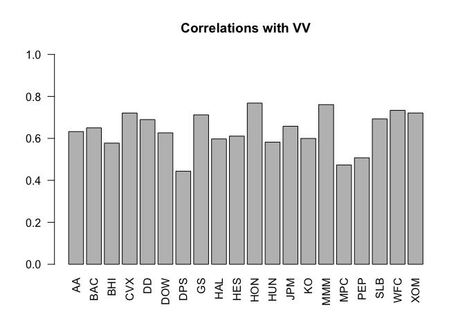
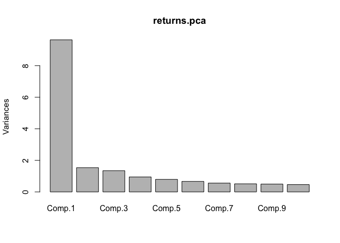
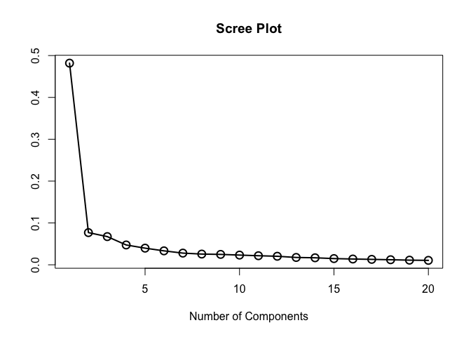
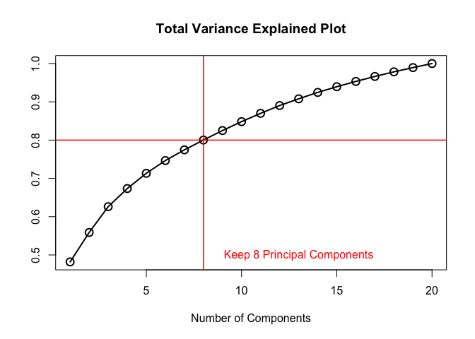
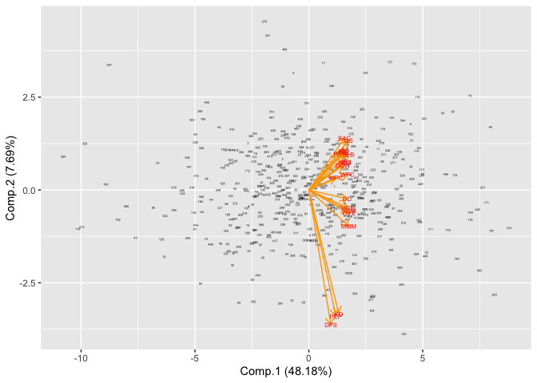
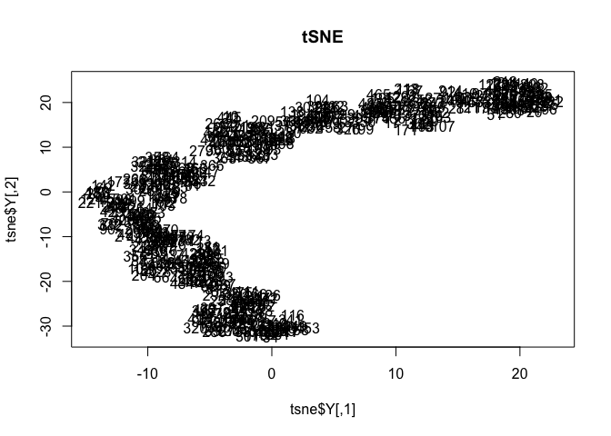

Principal Components (PCA) and Stochastic Neighbor Embedding (t-SNE)
================
Nadia Noui-Mehidi

Our data consists of daily closing stock prices for twenty stocks and a
large-cap index fund from Vanguard (VV). A summary and the first 6 rows
of the data set are below.

``` r
str(my.data)
```

    ## 'data.frame':    502 obs. of  43 variables:
    ##  $ Date       : Factor w/ 502 levels "1-Apr-13","1-Aug-12",..: 367 408 425 443 492 22 38 57 76 141 ...
    ##  $ AA         : num  9.23 9.45 9.36 9.16 9.42 9.44 9.63 9.93 9.8 9.76 ...
    ##  $ BAC        : num  5.8 5.81 6.31 6.18 6.27 6.63 6.87 6.79 6.61 6.48 ...
    ##  $ BHI        : num  51 51.5 50.8 51.3 51.6 ...
    ##  $ CVX        : num  110 110 109 108 109 ...
    ##  $ DD         : num  46.5 47 46.7 46 46.4 ...
    ##  $ DOW        : num  29.8 29.9 30.1 30.3 30.3 ...
    ##  $ DPS        : num  38.3 38.5 38.8 38.5 38.5 ...
    ##  $ GS         : num  95.4 94.7 94.6 93.4 94.7 ...
    ##  $ HAL        : num  34.1 35.1 34.6 35 35.4 ...
    ##  $ HES        : num  58.4 59 57.6 56.4 56.9 ...
    ##  $ HON        : num  55.6 55.5 55.6 55.2 55.6 ...
    ##  $ HUN        : num  9.95 9.87 9.82 9.9 9.84 ...
    ##  $ JPM        : num  35 35 35.7 35.4 35.3 ...
    ##  $ KO         : num  35.1 34.9 34.7 34.5 34.5 ...
    ##  $ MMM        : num  83.5 84.2 83.8 83.4 83.9 ...
    ##  $ MPC        : num  33.4 33.8 31.9 31.7 31 ...
    ##  $ PEP        : num  66.4 66.7 66.2 65.4 65.7 ...
    ##  $ SLB        : num  70.1 69.6 68.1 67.8 68.8 ...
    ##  $ WFC        : num  28.4 28.6 29 28.9 29.3 ...
    ##  $ XOM        : num  86 86 85.8 85.1 85.5 ...
    ##  $ VV         : num  58.2 58.2 58.4 58.3 58.5 ...
    ##  $ return_AA  : num  NA 0.02356 -0.00957 -0.0216 0.02799 ...
    ##  $ return_BAC : num  NA 0.00172 0.08256 -0.02082 0.01446 ...
    ##  $ return_BHI : num  NA 0.00995 -0.01387 0.00862 0.00622 ...
    ##  $ return_CVX : num  NA -0.00172 -0.00985 -0.00727 0.01084 ...
    ##  $ return_DD  : num  NA 0.01091 -0.00683 -0.01423 0.00844 ...
    ##  $ return_DOW : num  NA 0.00536 0.00632 0.00595 -0.00033 ...
    ##  $ return_DPS : num  NA 0.00546 0.00621 -0.00698 0 ...
    ##  $ return_GS  : num  NA -0.00652 -0.00169 -0.01234 0.0135 ...
    ##  $ return_HAL : num  NA 0.028 -0.0161 0.0121 0.0114 ...
    ##  $ return_HES : num  NA 0.01022 -0.02402 -0.0207 0.00847 ...
    ##  $ return_HON : num  NA -0.0009 0.00108 -0.0074 0.0083 ...
    ##  $ return_HUN : num  NA -0.00807 -0.00508 0.00811 -0.00608 ...
    ##  $ return_JPM : num  NA -0.000858 0.020672 -0.009009 -0.001698 ...
    ##  $ return_KO  : num  NA -0.00629 -0.00489 -0.00636 0 ...
    ##  $ return_MMM : num  NA 0.00823 -0.00452 -0.00514 0.00598 ...
    ##  $ return_MPC : num  NA 0.01042 -0.05604 -0.00818 -0.02236 ...
    ##  $ return_PEP : num  NA 0.00511 -0.00782 -0.01261 0.00519 ...
    ##  $ return_SLB : num  NA -0.00759 -0.02165 -0.00427 0.01523 ...
    ##  $ return_WFC : num  NA 0.00456 0.01598 -0.00276 0.01236 ...
    ##  $ return_XOM : num  NA 0.000233 -0.003027 -0.007491 0.004454 ...
    ##  $ response_VV: num  NA 0.0012 0.00326 -0.00206 0.00223 ...

``` r
head(my.data)
```

    ##        Date   AA  BAC   BHI    CVX    DD   DOW   DPS    GS   HAL   HES
    ## 1  3-Jan-12 9.23 5.80 51.02 110.37 46.51 29.79 38.34 95.36 34.15 58.40
    ## 2  4-Jan-12 9.45 5.81 51.53 110.18 47.02 29.95 38.55 94.74 35.12 59.00
    ## 3  5-Jan-12 9.36 6.31 50.82 109.10 46.70 30.14 38.79 94.58 34.56 57.60
    ## 4  6-Jan-12 9.16 6.18 51.26 108.31 46.04 30.32 38.52 93.42 34.98 56.42
    ## 5  9-Jan-12 9.42 6.27 51.58 109.49 46.43 30.31 38.52 94.69 35.38 56.90
    ## 6 10-Jan-12 9.44 6.63 51.95 109.06 47.14 30.98 38.62 98.33 36.33 58.56
    ##     HON   HUN   JPM    KO   MMM   MPC   PEP   SLB   WFC   XOM    VV
    ## 1 55.58  9.95 34.98 35.07 83.49 33.41 66.40 70.09 28.43 86.00 58.18
    ## 2 55.53  9.87 34.95 34.85 84.18 33.76 66.74 69.56 28.56 86.02 58.25
    ## 3 55.59  9.82 35.68 34.68 83.80 31.92 66.22 68.07 29.02 85.76 58.44
    ## 4 55.18  9.90 35.36 34.46 83.37 31.66 65.39 67.78 28.94 85.12 58.32
    ## 5 55.64  9.84 35.30 34.46 83.87 30.96 65.73 68.82 29.30 85.50 58.45
    ## 6 56.58 10.20 36.05 34.67 84.30 31.83 65.66 70.75 29.41 85.72 58.99
    ##     return_AA  return_BAC  return_BHI return_CVX  return_DD  return_DOW
    ## 1          NA          NA          NA         NA         NA          NA
    ## 2  0.02355570  0.00172265  0.00994640 -0.0017230  0.0109057  0.00535656
    ## 3 -0.00956900  0.08255511 -0.01387400 -0.0098500 -0.0068289  0.00632387
    ## 4 -0.02159900 -0.02081700  0.00862070 -0.0072674 -0.0142340  0.00595437
    ## 5  0.02798890  0.01445810  0.00622328  0.0108357  0.0084352 -0.00032987
    ## 6  0.00212089  0.05582840  0.00714772 -0.0039350  0.0151761  0.02186410
    ##    return_DPS  return_GS return_HAL return_HES  return_HON return_HUN
    ## 1          NA         NA         NA         NA          NA         NA
    ## 2  0.00546236 -0.0065229  0.0280082  0.0102216 -0.00090001 -0.0080730
    ## 3  0.00620638 -0.0016903 -0.0160740 -0.0240150  0.00107991 -0.0050787
    ## 4 -0.00698490 -0.0123410  0.0120795 -0.0206990 -0.00740280  0.0081136
    ## 5  0.00000000  0.0135029  0.0113702  0.0084716  0.00830180 -0.0060790
    ## 6  0.00259269  0.0377208  0.0264972  0.0287565  0.01675320  0.0359320
    ##   return_JPM   return_KO  return_MMM return_MPC  return_PEP return_SLB
    ## 1         NA          NA          NA         NA          NA         NA
    ## 2 -0.0008580 -0.00629290  0.00823050  0.0104214  0.00510742 -0.0075904
    ## 3  0.0206718 -0.00489000 -0.00452440 -0.0560440 -0.00782200 -0.0216530
    ## 4 -0.0090090 -0.00636390 -0.00514450 -0.0081790 -0.01261300 -0.0042694
    ## 5 -0.0016983  0.00000000  0.00597945 -0.0223580  0.00518610  0.0152272
    ## 6  0.0210239  0.00607553  0.00511388  0.0277132 -0.00106550  0.0276581
    ##    return_WFC   return_XOM response_VV
    ## 1          NA           NA          NA
    ## 2  0.00456221  0.000232531  0.00120244
    ## 3  0.01597810 -0.003027100  0.00325649
    ## 4 -0.00276050 -0.007490700 -0.00205550
    ## 5  0.01236280  0.004454350  0.00222660
    ## 6  0.00374724  0.002569790  0.00919630

Our data has 21 numerical variables; our target variable “VV”
representing our market index and 10 explanatory variables representing
a stock price. There is also a date variable representing the calendar
date. Each record represents the closing stock prices and market index
for a particular day. We want to use the individual stock amounts to
explain the variation in the market index. We will explore this concept
using both linear regression and principal components analysis.

## 1\. Standardization of Variables

Let’s begin our analysis with some data preparation. It is usually
beneficial for each variable to be centered at zero for PCA, due to the
fact that it makes comparing each principal component to the mean
straightforward. This also eliminates potential problems with the scale
of each variable. We standardize each of our numeric variables with a
log return transformation and store the standardized variables in a new
dataset. The first 6 observations in our transformed dataset is below:

``` r
# Note Date is a string of dd-Mon-yy in R this is '%d-%B-%y';
my.data$RDate <- as.Date(my.data$Date,'%d-%B-%y');
sorted.df <- my.data[order(my.data$RDate),];


AA <- log(sorted.df$AA[-1]/sorted.df$AA[-dim(sorted.df)[1]]);

# Manually check the first entry: log(9.45/9.23)
# Type cast the array as a data frame;
returns.df <- as.data.frame(AA);
str(returns.df)
```

    ## 'data.frame':    501 obs. of  1 variable:
    ##  $ AA: num  0.02356 -0.00957 -0.0216 0.02799 0.00212 ...

``` r
returns.df$BAC <- log(sorted.df$BAC[-1]/sorted.df$BAC[-dim(sorted.df)[1]]);
returns.df$BHI <- log(sorted.df$BHI[-1]/sorted.df$BHI[-dim(sorted.df)[1]]);
returns.df$CVX <- log(sorted.df$CVX[-1]/sorted.df$CVX[-dim(sorted.df)[1]]);
returns.df$DD  <- log(sorted.df$DD[-1]/sorted.df$DD[-dim(sorted.df)[1]]);
returns.df$DOW <- log(sorted.df$DOW[-1]/sorted.df$DOW[-dim(sorted.df)[1]]);
returns.df$DPS <- log(sorted.df$DPS[-1]/sorted.df$DPS[-dim(sorted.df)[1]]);
returns.df$GS  <- log(sorted.df$GS[-1]/sorted.df$GS[-dim(sorted.df)[1]]);
returns.df$HAL <- log(sorted.df$HAL[-1]/sorted.df$HAL[-dim(sorted.df)[1]]);
returns.df$HES <- log(sorted.df$HES[-1]/sorted.df$HES[-dim(sorted.df)[1]]);
returns.df$HON <- log(sorted.df$HON[-1]/sorted.df$HON[-dim(sorted.df)[1]]);
returns.df$HUN <- log(sorted.df$HUN[-1]/sorted.df$HUN[-dim(sorted.df)[1]]);
returns.df$JPM <- log(sorted.df$JPM[-1]/sorted.df$JPM[-dim(sorted.df)[1]]);
returns.df$KO  <- log(sorted.df$KO[-1]/sorted.df$KO[-dim(sorted.df)[1]]);
returns.df$MMM <- log(sorted.df$MMM[-1]/sorted.df$MMM[-dim(sorted.df)[1]]);
returns.df$MPC <- log(sorted.df$MPC[-1]/sorted.df$MPC[-dim(sorted.df)[1]]);
returns.df$PEP <- log(sorted.df$PEP[-1]/sorted.df$PEP[-dim(sorted.df)[1]]);
returns.df$SLB <- log(sorted.df$SLB[-1]/sorted.df$SLB[-dim(sorted.df)[1]]);
returns.df$WFC <- log(sorted.df$WFC[-1]/sorted.df$WFC[-dim(sorted.df)[1]]);
returns.df$XOM <- log(sorted.df$XOM[-1]/sorted.df$XOM[-dim(sorted.df)[1]]);
returns.df$VV  <- log(sorted.df$VV[-1]/sorted.df$VV[-dim(sorted.df)[1]]);
str(returns.df)
```

    ## 'data.frame':    501 obs. of  21 variables:
    ##  $ AA : num  0.02356 -0.00957 -0.0216 0.02799 0.00212 ...
    ##  $ BAC: num  0.00172 0.08256 -0.02082 0.01446 0.05583 ...
    ##  $ BHI: num  0.00995 -0.01387 0.00862 0.00622 0.00715 ...
    ##  $ CVX: num  -0.00172 -0.00985 -0.00727 0.01084 -0.00394 ...
    ##  $ DD : num  0.01091 -0.00683 -0.01423 0.00844 0.01518 ...
    ##  $ DOW: num  0.00536 0.00632 0.00595 -0.00033 0.02186 ...
    ##  $ DPS: num  0.00546 0.00621 -0.00698 0 0.00259 ...
    ##  $ GS : num  -0.00652 -0.00169 -0.01234 0.0135 0.03772 ...
    ##  $ HAL: num  0.028 -0.0161 0.0121 0.0114 0.0265 ...
    ##  $ HES: num  0.01022 -0.02401 -0.0207 0.00847 0.02876 ...
    ##  $ HON: num  -0.0009 0.00108 -0.0074 0.0083 0.01675 ...
    ##  $ HUN: num  -0.00807 -0.00508 0.00811 -0.00608 0.03593 ...
    ##  $ JPM: num  -0.000858 0.020672 -0.009009 -0.001698 0.021024 ...
    ##  $ KO : num  -0.00629 -0.00489 -0.00636 0 0.00608 ...
    ##  $ MMM: num  0.00823 -0.00452 -0.00514 0.00598 0.00511 ...
    ##  $ MPC: num  0.01042 -0.05604 -0.00818 -0.02236 0.02771 ...
    ##  $ PEP: num  0.00511 -0.00782 -0.01261 0.00519 -0.00107 ...
    ##  $ SLB: num  -0.00759 -0.02165 -0.00427 0.01523 0.02766 ...
    ##  $ WFC: num  0.00456 0.01598 -0.00276 0.01236 0.00375 ...
    ##  $ XOM: num  0.000233 -0.003027 -0.007491 0.004454 0.00257 ...
    ##  $ VV : num  0.0012 0.00326 -0.00206 0.00223 0.0092 ...

``` r
head(returns.df)
```

    ##             AA          BAC          BHI          CVX           DD
    ## 1  0.023555693  0.001722653  0.009946450 -0.001722966  0.010905700
    ## 2 -0.009569451  0.082555106 -0.013874184 -0.009850499 -0.006828878
    ## 3 -0.021599112 -0.020817405  0.008620743 -0.007267407 -0.014233581
    ## 4  0.027988910  0.014458083  0.006223280  0.010835735  0.008435218
    ## 5  0.002120892  0.055828450  0.007147717 -0.003935031  0.015176095
    ## 6  0.019927246  0.035559302 -0.034067507 -0.011898863  0.003388398
    ##             DOW          DPS           GS         HAL          HES
    ## 1  0.0053565578  0.005462362 -0.006522906  0.02800818  0.010221554
    ## 2  0.0063238686  0.006206381 -0.001690260 -0.01607382 -0.024014876
    ## 3  0.0059543676 -0.006984895 -0.012340582  0.01207953 -0.020698862
    ## 4 -0.0003298697  0.000000000  0.013502943  0.01137022  0.008471636
    ## 5  0.0218641439  0.002592690  0.037720771  0.02649716  0.028756529
    ## 6  0.0144210158 -0.012244519  0.014438133 -0.02649716 -0.010643877
    ##             HON          HUN           JPM           KO          MMM
    ## 1 -0.0009000091 -0.008072698 -0.0008580009 -0.006292927  0.008230499
    ## 2  0.0010799137 -0.005078731  0.0206718390 -0.004889985 -0.004524356
    ## 3 -0.0074027602  0.008113635 -0.0090090699 -0.006363921 -0.005144475
    ## 4  0.0083017983 -0.006079046 -0.0016982738  0.000000000  0.005979449
    ## 5  0.0167531988  0.035932009  0.0210238998  0.006075529  0.005113884
    ## 6 -0.0021231430  0.037522439  0.0167793787 -0.018632271 -0.006306917
    ##            MPC          PEP          SLB          WFC           XOM
    ## 1  0.010421413  0.005107417 -0.007590441  0.004562212  0.0002325311
    ## 2 -0.056043897 -0.007821941 -0.021653102  0.015978110 -0.0030271300
    ## 3 -0.008178718 -0.012613191 -0.004269421 -0.002760526 -0.0074906717
    ## 4 -0.022358006  0.005186101  0.015227234  0.012362795  0.0044543503
    ## 5  0.027713193 -0.001065530  0.027658136  0.003747237  0.0025697947
    ## 6  0.032759419 -0.009948808 -0.008374188  0.007115056 -0.0074941803
    ##             VV
    ## 1  0.001202439
    ## 2  0.003256494
    ## 3 -0.002055499
    ## 4  0.002226600
    ## 5  0.009196250
    ## 6  0.001185938

## 2\. Correlations between Explanatory Variables and our Target

We begin our exploratory data analysis by looking at our explanatory
variable’s correlation to our target variable “VV”.

    ##        AA       BAC       BHI       CVX        DD       DOW       DPS 
    ## 0.6324106 0.6501877 0.5774988 0.7209041 0.6895190 0.6264550 0.4435005 
    ##        GS       HAL       HES       HON       HUN       JPM        KO 
    ## 0.7121620 0.5974989 0.6107960 0.7683784 0.5819449 0.6578478 0.5997988 
    ##       MMM       MPC       PEP       SLB       WFC       XOM        VV 
    ## 0.7608489 0.4731198 0.5075264 0.6928534 0.7335731 0.7211079 1.0000000

<!-- --> All our
variables have a correlation to VV of at least 0.44. The variables most
highly correlated to VV are MMM (0.76), WFC (0.73) XOM & CVX (0.72).
This tells us our variables are not independent from the target which
means there is some underlying pattern to uncover. Since all of our
variables are strongly correlated to the target we may have some
multicollinearity in our data.

## 3\. Pairwise Correlations

Multicollinearity exists among the explanatory variables when these
variables are correlated among themselves. We use a corrplot to
visualize the pairwise correlations between our explanatory variables.
If correlation among pairs of variables are large this means we have
redundancy in our data. This can have effects on the extra sums of
squares, fitted values and predictions, regression coefficients, and
many other parts of multiple linear regression.

``` r
# Make correlation plot for returns;
require(corrplot)
```

    ## Loading required package: corrplot

    ## corrplot 0.84 loaded

``` r
corrplot(returns.cor)
```

<!-- -->
Our corrplot seems to indicate heavy correlation between most of the
explanatory variables. Variables that look like they have expecially
large covariance are XOM WFC SLB HON HAL GS MMM CVX. These variables
look like they are theyre statistically dependent or in other words
there is a lot of redundancy between the variables. They probably have
high VIF levels. Only three variables (DPS, MPC, PEP) look like they
have relatively low covariance. This means theyre statistically
independent or orthogonal, they dont move together. They probably have
low VIF values.

For a more rigorous examination of multicollinearity we should regress
these variables.

## 4 Linear Regression

A linear regression model can be fitted and collinearity between
predictors detected using Variance Inflation Factor (VIF).

With VV as our target variable we create two linear regressions. A full
model using all the explanatory variables and simple model including
only the following explanatory variables:
GS+DD+DOW+HON+HUN+JPM+KO+MMM+XOM

``` r
require(car)
```

    ## Loading required package: car

    ## Loading required package: carData

``` r
# Fit some model
model.1 <- lm(VV ~ GS+DD+DOW+HON+HUN+JPM+KO+MMM+XOM, data=returns.df)
summary(model.1)
```

    ## 
    ## Call:
    ## lm(formula = VV ~ GS + DD + DOW + HON + HUN + JPM + KO + MMM + 
    ##     XOM, data = returns.df)
    ## 
    ## Residuals:
    ##        Min         1Q     Median         3Q        Max 
    ## -0.0139179 -0.0016005 -0.0000926  0.0016690  0.0172703 
    ## 
    ## Coefficients:
    ##              Estimate Std. Error t value Pr(>|t|)    
    ## (Intercept) 0.0001008  0.0001331   0.757 0.449290    
    ## GS          0.0784765  0.0138277   5.675 2.37e-08 ***
    ## DD          0.0354057  0.0177154   1.999 0.046204 *  
    ## DOW         0.0406763  0.0116993   3.477 0.000552 ***
    ## HON         0.1449817  0.0170837   8.487 2.53e-16 ***
    ## HUN         0.0385118  0.0077371   4.978 8.93e-07 ***
    ## JPM         0.0505123  0.0132262   3.819 0.000151 ***
    ## KO          0.1419686  0.0176282   8.054 6.14e-15 ***
    ## MMM         0.1336002  0.0239378   5.581 3.96e-08 ***
    ## XOM         0.1480728  0.0213601   6.932 1.31e-11 ***
    ## ---
    ## Signif. codes:  0 '***' 0.001 '**' 0.01 '*' 0.05 '.' 0.1 ' ' 1
    ## 
    ## Residual standard error: 0.002951 on 491 degrees of freedom
    ## Multiple R-squared:  0.8518, Adjusted R-squared:  0.849 
    ## F-statistic: 313.5 on 9 and 491 DF,  p-value: < 2.2e-16

``` r
# Fit the full model
model.2 <- lm(VV ~ BAC+GS+JPM+WFC+BHI+CVX+DD+DOW+DPS+HAL+HES+HON+HUN+KO+MMM+MPC+PEP+SLB+XOM,data=returns.df)
summary(model.2)
```

    ## 
    ## Call:
    ## lm(formula = VV ~ BAC + GS + JPM + WFC + BHI + CVX + DD + DOW + 
    ##     DPS + HAL + HES + HON + HUN + KO + MMM + MPC + PEP + SLB + 
    ##     XOM, data = returns.df)
    ## 
    ## Residuals:
    ##        Min         1Q     Median         3Q        Max 
    ## -0.0138057 -0.0015122  0.0000384  0.0014777  0.0143463 
    ## 
    ## Coefficients:
    ##               Estimate Std. Error t value Pr(>|t|)    
    ## (Intercept)  8.846e-05  1.213e-04   0.730 0.466020    
    ## BAC          3.037e-02  9.474e-03   3.205 0.001440 ** 
    ## GS           3.528e-02  1.358e-02   2.598 0.009675 ** 
    ## JPM          2.019e-02  1.323e-02   1.526 0.127769    
    ## WFC          7.829e-02  1.581e-02   4.952 1.02e-06 ***
    ## BHI          1.834e-02  1.152e-02   1.593 0.111884    
    ## CVX          5.925e-02  2.067e-02   2.866 0.004337 ** 
    ## DD           1.148e-02  1.624e-02   0.707 0.480021    
    ## DOW          3.671e-02  1.070e-02   3.431 0.000652 ***
    ## DPS          5.722e-02  1.495e-02   3.828 0.000146 ***
    ## HAL         -5.837e-04  1.208e-02  -0.048 0.961476    
    ## HES          4.589e-03  9.699e-03   0.473 0.636297    
    ## HON          1.085e-01  1.607e-02   6.751 4.25e-11 ***
    ## HUN          2.988e-02  7.184e-03   4.160 3.78e-05 ***
    ## KO           9.194e-02  1.843e-02   4.990 8.45e-07 ***
    ## MMM          1.117e-01  2.198e-02   5.080 5.41e-07 ***
    ## MPC          1.059e-02  7.032e-03   1.506 0.132741    
    ## PEP          2.024e-02  2.036e-02   0.994 0.320703    
    ## SLB          4.807e-02  1.454e-02   3.306 0.001019 ** 
    ## XOM          6.115e-02  2.294e-02   2.665 0.007947 ** 
    ## ---
    ## Signif. codes:  0 '***' 0.001 '**' 0.01 '*' 0.05 '.' 0.1 ' ' 1
    ## 
    ## Residual standard error: 0.002669 on 481 degrees of freedom
    ## Multiple R-squared:  0.8812, Adjusted R-squared:  0.8765 
    ## F-statistic: 187.8 on 19 and 481 DF,  p-value: < 2.2e-16

After running our regressions we see if the analysis exhibits any signs
of multicollinearity. Some indicators are that the F-test for overall
model is significant but the t-tests for individual coefficient
estimates are not, the R-square value is large but none of the beta
weights is statistically significant, or coefficient estimates vary from
model to model

We evaluate our models’ fit with the ANOVA test. The F statistic is
highly significant for both models, so the model fits the data better
than guessing the mean. Our R squared values of 84 and 87% tell us the
percentage from the dependant variable’s variation which is explained by
the model.

We look at each predictors coefficient and its significance level to
determine which explanatory variables contribute to the model. In our
partial model, all our variables are highly significant but in the full
model seven of our variables, including ones that were included in the
partial model, are no longer significantly different from 0. This
suggests we do have a problem with multicollinearity. By overinflating
the standard errors, multicollinearity makes some variables
statistically insignificant when they should be significant.

Multicollinearity is also measured using a Variance Inflation Factor
(VIF). VIF is a measure of how much the variance of the estimated
regression coefficient, can be inflated by the existence of correlations
among the predictor variables in the model. If the VIF is equal to 1
there is no multicollinearity among factors, but if the VIF is greater
than 1, the predictors may be moderately correlated. The VIF for the
partial and full models are below

``` r
print("Partial Model VIF:")
```

    ## [1] "Partial Model VIF:"

``` r
vif(model.1)
```

    ##       GS       DD      DOW      HON      HUN      JPM       KO      MMM 
    ## 2.705795 2.368257 1.919773 2.261397 1.633336 2.324600 1.473202 2.590177 
    ##      XOM 
    ## 2.073721

``` r
print("Full Model VIF:")
```

    ## [1] "Full Model VIF:"

``` r
vif(model.2)
```

    ##      BAC       GS      JPM      WFC      BHI      CVX       DD      DOW 
    ## 2.558097 3.190808 2.844537 2.528808 2.603510 2.909686 2.432674 1.961953 
    ##      DPS      HAL      HES      HON      HUN       KO      MMM      MPC 
    ## 1.524399 2.902240 2.095666 2.447013 1.721319 1.967512 2.670404 1.376185 
    ##      PEP      SLB      XOM 
    ## 1.719788 3.257595 2.924084

The output above shows that every variable has at least moderate VIF
(1.5 or higher). Most variables have a VIF greater than 2 and the
highest VIF is GS at 3.2. A VIF between 5 and 10 is usually considered
problematic, being a clue for predictors multicollinearity. Our
variables indicate moderate multicollinearity but not enough to assume
that the regression coefficients are poorly estimated due to
multicollinearity.

## 5\. Principal Component Analysis

Principal Component Analysis (PCA) is a method of dimension reduction
that is particularly useful when the variables within the data set are
highly correlated. Correlation indicates a redundancy in the data. PCA
can be used to reduce the original variables into a smaller number of
new variables (components) that explain most of the variance in the
original variables.

### Choosing Components

The first principal component of a data set is the linear combination of
the explanatory variables that explains the largest amount of variance
in the data. The second principal component is the linear combination of
variables that has maximal variance out of all linear combinations that
are uncorrelated with - or orthigonal to- our first component. Each
subsequent component explains less of the variation than the previous
one. The components we select become the axis of a new low dimensional
coordinate system; the goal when selecting components is to reduce
dimenionality while preserving the underlying relationship between
variables.

A summary of our principal components is below:

``` r
returns.pca <- princomp(x=returns.df[,-21],cor=TRUE)
summary(returns.pca)
```

    ## Importance of components:
    ##                           Comp.1     Comp.2     Comp.3     Comp.4
    ## Standard deviation     3.1042633 1.24037473 1.16079159 0.97348817
    ## Proportion of Variance 0.4818225 0.07692647 0.06737186 0.04738396
    ## Cumulative Proportion  0.4818225 0.55874901 0.62612087 0.67350483
    ##                            Comp.5    Comp.6     Comp.7     Comp.8
    ## Standard deviation     0.89191173 0.8163381 0.74727540 0.71606462
    ## Proportion of Variance 0.03977533 0.0333204 0.02792103 0.02563743
    ## Cumulative Proportion  0.71328015 0.7466005 0.77452158 0.80015900
    ##                            Comp.9    Comp.10    Comp.11   Comp.12
    ## Standard deviation     0.70486968 0.68141987 0.65836107 0.6385577
    ## Proportion of Variance 0.02484206 0.02321665 0.02167196 0.0203878
    ## Cumulative Proportion  0.82500107 0.84821772 0.86988968 0.8902775
    ##                          Comp.13    Comp.14    Comp.15    Comp.16
    ## Standard deviation     0.5925250 0.57888423 0.54494939 0.52563057
    ## Proportion of Variance 0.0175543 0.01675535 0.01484849 0.01381437
    ## Cumulative Proportion  0.9078318 0.92458713 0.93943562 0.95324999
    ##                           Comp.17   Comp.18   Comp.19    Comp.20
    ## Standard deviation     0.50927436 0.4919940 0.4710181 0.46013436
    ## Proportion of Variance 0.01296802 0.0121029 0.0110929 0.01058618
    ## Cumulative Proportion  0.96621801 0.9783209 0.9894138 1.00000000

``` r
plot(returns.pca)
```

<!-- -->
From the output we can see that 48.2% of the variation in the data can
be explained by the first component alone, and 56% is explained by the
first two components. In using PCA for dimension reduction, after we
compute the principal components we need to decide how many principal
components to keep or retain. We could use a ‘total variance explained’
decision rule to choose the number of components to use. For example, we
could say that we want an explained variance of at least 80%. In this
case, to get 80% of variance explained we would choose the first 8
principal components. Another tool for choosing the number of principal
components is to make a scree plot. A scree plot shows the proportion of
variance explained by each Principal Component. There is often a break
point between a steep part of the line and a shallower part of the line
(the elbow). We could use this elbow as our break off point. In this
case, since the proportion of variance explained for our data drops off
significantly after the first component and remains flat beyond that,
the scree plot isnt that helpful. We will use the 80% thresehold as our
decision rule and keep the first 8 components.

``` r
# Make Scree Plot
scree.values <- (returns.pca$sdev^2)/sum(returns.pca$sdev^2);

plot(scree.values,xlab='Number of Components',ylab='',type='l',lwd=2)
points(scree.values,lwd=2,cex=1.5)
title('Scree Plot')
```

<!-- -->

``` r
# Make Proportion of Variance Explained
variance.values <- cumsum(returns.pca$sdev^2)/sum(returns.pca$sdev^2);

plot(variance.values,xlab='Number of Components',ylab='',type='l',lwd=2)
points(variance.values,lwd=2,cex=1.5)
abline(h=0.8,lwd=1.5,col='red')
abline(v=8,lwd=1.5,col='red')
text(13,0.5,'Keep 8 Principal Components',col='red')
title('Total Variance Explained Plot')
```

<!-- -->

\#\#\#Loadings The coefficients of the linear combination that make up
our Principal Component can be described by a vector called the loading.
The loading can tell us something about the underylying phenomenon
causing the variation, for example it could be comprimised by variables
that together describe some latent variable that we can name. The
individual coefficients tells us the correlation between the original
variable and the axis; they indicate the direction and magnitude in the
increase in that variable. A larger coefficient indicates that the
variable is important in explaining the difference between the samples
among that axis. The loading vector can help us decide which variables
are important and which (if any) can be dropped from the data set.

The principal components for our data and their associated loading
vectors are below.

``` r
returns.pca$loadings 
```

    ## 
    ## Loadings:
    ##     Comp.1 Comp.2 Comp.3 Comp.4 Comp.5 Comp.6 Comp.7 Comp.8 Comp.9 Comp.10
    ## AA   0.229  0.157                0.199         0.422  0.665  0.148  0.106 
    ## BAC  0.225  0.201 -0.341 -0.299                0.115  0.129 -0.116        
    ## BHI  0.219  0.150  0.439                0.219 -0.169                0.227 
    ## CVX  0.253         0.167               -0.418  0.151        -0.159        
    ## DD   0.241        -0.122  0.348  0.190               -0.131         0.291 
    ## DOW  0.214        -0.172  0.454  0.103 -0.147        -0.267 -0.235  0.456 
    ## DPS  0.139 -0.520               -0.108  0.486  0.543 -0.167         0.162 
    ## GS   0.251  0.191 -0.190 -0.290                                           
    ## HAL  0.228  0.146  0.402                0.307 -0.200                      
    ## HES  0.228  0.108  0.225        -0.219 -0.163  0.285 -0.184 -0.462 -0.409 
    ## HON  0.248                0.175                      -0.264  0.428 -0.413 
    ## HUN  0.197  0.140 -0.183  0.479 -0.135  0.316 -0.152  0.288 -0.308 -0.398 
    ## JPM  0.227  0.107 -0.348 -0.373         0.115        -0.146         0.108 
    ## KO   0.188 -0.479                             -0.234        -0.219        
    ## MMM  0.251 -0.140         0.122  0.215                       0.474 -0.199 
    ## MPC  0.171                0.121 -0.872 -0.129                0.327  0.219 
    ## PEP  0.170 -0.488                             -0.435  0.413               
    ## SLB  0.250  0.138  0.327                0.107 -0.171 -0.119               
    ## WFC  0.243        -0.284 -0.150               -0.107                      
    ## XOM  0.254         0.136               -0.474  0.116                      
    ##     Comp.11 Comp.12 Comp.13 Comp.14 Comp.15 Comp.16 Comp.17 Comp.18
    ## AA   0.110   0.283   0.133   0.128   0.163   0.150           0.102 
    ## BAC                  0.210          -0.566  -0.308  -0.159  -0.247 
    ## BHI  0.173          -0.270           0.260  -0.194  -0.463         
    ## CVX  0.126  -0.169  -0.219  -0.329  -0.202   0.204  -0.321   0.293 
    ## DD  -0.131  -0.413           0.519  -0.209   0.352                 
    ## DOW          0.429          -0.216   0.145  -0.247                 
    ## DPS                 -0.187  -0.167          -0.119   0.130         
    ## GS  -0.243           0.104           0.361           0.218   0.563 
    ## HAL                  0.116                   0.300   0.305  -0.360 
    ## HES -0.218   0.166           0.415   0.140          -0.130  -0.115 
    ## HON          0.431          -0.153  -0.151   0.315  -0.210         
    ## HUN         -0.313          -0.300                                 
    ## JPM         -0.131   0.101  -0.165   0.214   0.319  -0.272  -0.177 
    ## KO   0.602           0.449   0.152   0.115                         
    ## MMM         -0.311   0.233           0.200  -0.479  -0.120  -0.117 
    ## MPC                                                                
    ## PEP -0.520   0.188  -0.161                                         
    ## SLB                                 -0.428  -0.207   0.225   0.438 
    ## WFC  0.372   0.128  -0.658   0.254          -0.133   0.306         
    ## XOM         -0.176          -0.331                   0.441  -0.348 
    ##     Comp.19 Comp.20
    ## AA   0.110   0.146 
    ## BAC -0.194  -0.252 
    ## BHI -0.398         
    ## CVX  0.344  -0.286 
    ## DD  -0.187         
    ## DOW                
    ## DPS                
    ## GS  -0.243  -0.371 
    ## HAL  0.331  -0.391 
    ## HES                
    ## HON -0.291         
    ## HUN                
    ## JPM  0.268   0.479 
    ## KO                 
    ## MMM  0.328         
    ## MPC                
    ## PEP                
    ## SLB          0.510 
    ## WFC  0.170         
    ## XOM -0.393   0.180 
    ## 
    ##                Comp.1 Comp.2 Comp.3 Comp.4 Comp.5 Comp.6 Comp.7 Comp.8
    ## SS loadings      1.00   1.00   1.00   1.00   1.00   1.00   1.00   1.00
    ## Proportion Var   0.05   0.05   0.05   0.05   0.05   0.05   0.05   0.05
    ## Cumulative Var   0.05   0.10   0.15   0.20   0.25   0.30   0.35   0.40
    ##                Comp.9 Comp.10 Comp.11 Comp.12 Comp.13 Comp.14 Comp.15
    ## SS loadings      1.00    1.00    1.00    1.00    1.00    1.00    1.00
    ## Proportion Var   0.05    0.05    0.05    0.05    0.05    0.05    0.05
    ## Cumulative Var   0.45    0.50    0.55    0.60    0.65    0.70    0.75
    ##                Comp.16 Comp.17 Comp.18 Comp.19 Comp.20
    ## SS loadings       1.00    1.00    1.00    1.00    1.00
    ## Proportion Var    0.05    0.05    0.05    0.05    0.05
    ## Cumulative Var    0.80    0.85    0.90    0.95    1.00

``` r
#returns.pca$scores 
```

Our first principal component’s loading vector includes all of our
explanatory variables and each coefficient expolaines a relatively equal
amount of the data variation. For this reason, we are not going to
eliminate any of our variables for analysis.

### Plotting Obvervations on a Low Dimensional Plot

We want to plot our data points on a two dimesional coordinate system
whose axis are first two principal components. Visualizing all
observations in a 2-d coordinate system can help us see underlying
relationships between data points. We are using a biplot to represent
both the observations and variables of multivariate data on the same
plot. The biplot is made up of: The score of each observation on the
first two principal components The loading of each variable on the first
two principal components.

The axes at the bottom and left of the biplot are the coordinate axes
for the observations. The axes at the top and right of the biplot are
the coordinate axes for the vectors.

In our biplot below, the two principal components account for
approximately 56% of the variance in the data. This means that the
biplot is an ok but not good approximation to the data.

``` r
pc.1 <- returns.pca$loadings[,1];
pc.2 <- returns.pca$loadings[,2];

library(ggbiplot)
```

    ## Loading required package: ggplot2

    ## Loading required package: plyr

    ## Loading required package: scales

    ## 
    ## Attaching package: 'scales'

    ## The following object is masked from 'package:readr':
    ## 
    ##     col_factor

    ## Loading required package: grid

``` r
#ggbiplot(returns.pca, labels=rownames(pc.1))

library(ggfortify)
```

    ## 
    ## Attaching package: 'ggfortify'

    ## The following object is masked from 'package:ggbiplot':
    ## 
    ##     ggbiplot

``` r
pca.plot <- autoplot(returns.pca, shape = FALSE, label.size = 1, loadings = TRUE, loadings.colour = 'orange', loadings.label = TRUE, loadings.label.size = 2, scale=0 )
pca.plot
```

<!-- -->
The cosine of the angle between a vector and an axis indicates the
importance of the contribution of the corresponding variable to the axis
dimension. all the arrows contribute about the same amount to PCA1,
though DPS contributes a little less than everyone else. DPS PEP KO
contribute the most to PCA2 and DD contributes the least

The cosine of the angle between vectors indicates correlation between
variables. Highly correlated variables (ie. DPS, KO, PEP) point in the
same direction; uncorrelated variables are at right angles to each other
(ie. DPS & BAC).

Points that are close to each other in the biplot represent observations
that are close together in space. If the data includes a categorical
variables, we could color code the points by category to see whether
observations cluster. For example, if we thought time of year effected
stock price, we could have created a categorical variable for Season or
Month or Fiscal Quarter and color coded the scores accordingly.

Note: This assignment asked us to color code our observations by
Industry. Industry has a relationship to Stocks which are the
explanatory variables (columns) instead of the observations which are
made up of many stocks and therefore many industries. Since the
relationship between Stock Industry and Observation is not one-to-one I
didnt know how to proceed with this part of the assignement. I had the
same problem color coding my tSNE graph.

\#\#7. Principal Component Regression Now let’s use principal components
in predictive modeling. The predictor variables for our predictive model
will be the PCA scores. Build a PCA model on the data in X, fitting the
8 components we selected. n PCR, instead of regressing the dependent
variable on the explanatory variables directly, the principal components
of the explanatory variables are used as regressors.

(What are the scores?) In order for us to be building predictive models,
we need to have a train data set and a test data set so let’s split our
data into train and test data sets manually by generating a uniform(0,1)
random variable and attaching it to the data frame.

``` r
# Create the data frame of PCA predictor variables;
return.scores <- as.data.frame(returns.pca$scores);
return.scores$VV <- returns.df$VV;
return.scores$u <- runif(n=dim(return.scores)[1],min=0,max=1);
#head(return.scores)

# Split the data set into train and test data sets;
train.scores <- subset(return.scores,u<0.70);
test.scores <- subset(return.scores,u>=0.70);
#dim(train.scores)
#dim(test.scores)
#dim(train.scores)+dim(test.scores)
#dim(return.scores)

# Fit a linear regression model using the first 8 principal components;
pca1.lm <- lm(VV ~ Comp.1+Comp.2+Comp.3+Comp.4+Comp.5+Comp.6+Comp.7+Comp.8, data=train.scores);
summary(pca1.lm)
```

    ## 
    ## Call:
    ## lm(formula = VV ~ Comp.1 + Comp.2 + Comp.3 + Comp.4 + Comp.5 + 
    ##     Comp.6 + Comp.7 + Comp.8, data = train.scores)
    ## 
    ## Residuals:
    ##       Min        1Q    Median        3Q       Max 
    ## -0.012649 -0.001465 -0.000012  0.001653  0.008394 
    ## 
    ## Coefficients:
    ##               Estimate Std. Error t value Pr(>|t|)    
    ## (Intercept)  6.917e-04  1.372e-04   5.042 7.31e-07 ***
    ## Comp.1       2.257e-03  4.415e-05  51.123  < 2e-16 ***
    ## Comp.2      -5.829e-04  1.099e-04  -5.303 2.00e-07 ***
    ## Comp.3      -4.770e-04  1.203e-04  -3.965 8.86e-05 ***
    ## Comp.4       2.122e-04  1.418e-04   1.497  0.13533    
    ## Comp.5       2.638e-04  1.512e-04   1.745  0.08190 .  
    ## Comp.6       6.487e-05  1.651e-04   0.393  0.69464    
    ## Comp.7      -1.880e-07  1.875e-04  -0.001  0.99920    
    ## Comp.8      -5.763e-04  2.017e-04  -2.857  0.00452 ** 
    ## ---
    ## Signif. codes:  0 '***' 0.001 '**' 0.01 '*' 0.05 '.' 0.1 ' ' 1
    ## 
    ## Residual standard error: 0.002627 on 359 degrees of freedom
    ## Multiple R-squared:  0.8821, Adjusted R-squared:  0.8795 
    ## F-statistic: 335.9 on 8 and 359 DF,  p-value: < 2.2e-16

``` r
# Compute the Mean Absolute Error on the training sample;
pca1.mae.train <- mean(abs(train.scores$VV-pca1.lm$fitted.values));
#vif(pca1.lm)

# Score the model out-of-sample and compute MAE;
pca1.test <- predict(pca1.lm,newdata=test.scores);
pca1.mae.test <- mean(abs(test.scores$VV-pca1.test));
```

Using our train and test data sets, we fit a linear regression model
using the first eight principal components and compute the Mean Absolute
Error (MAE) for that model. We will call this model pca1.lm. We score
our model on our test data set and compute the out-of-sample MAE. Note:
The VIF values associated with every predictor variable in any principal
components regression model should all be one. Why?

\#\#8. Comparing Models (Principal Component Regression Vs Linear
Regressions) We will use MAE to compare the accuracy of our predictive
models. MAE tells us the average of the errors between our modles
predictions and the actual value. After running our PCA and linear
regression models through the test and training datasets we come up with
the MAE table that you see below:

``` r
# Let's compare the PCA regression model with a 'raw' regression model;
# Create a train/test split of the returns data set to match the scores data set;
returns.df$u <- return.scores$u;
train.returns <- subset(returns.df,u<0.70);
test.returns <- subset(returns.df,u>=0.70);
#dim(train.returns)
#dim(test.returns)
#dim(train.returns)+dim(test.returns)
#dim(returns.df)


# Fit model.1 on train data set and 'test' on test data;
model.1 <- lm(VV ~ GS+DD+DOW+HON+HUN+JPM+KO+MMM+XOM, data=train.returns)
model1.mae.train <- mean(abs(train.returns$VV-model.1$fitted.values));
model1.test <- predict(model.1,newdata=test.returns);
model1.mae.test <- mean(abs(test.returns$VV-model1.test));


# Fit model.2 on train data set and 'test' on test data;
model.2 <- lm(VV ~ BAC+GS+JPM+WFC+BHI+CVX+DD+DOW+DPS+HAL+HES+HON+HUN+KO+MMM+MPC+PEP+SLB+XOM, data=train.returns)
model2.mae.train <- mean(abs(train.returns$VV-model.2$fitted.values));
model2.test <- predict(model.2,newdata=test.returns);
model2.mae.test <- mean(abs(test.returns$VV-model2.test));
#create a table of the MAE values from pca1.lm model.1 model.2

mae <- matrix(c( 0.002221394,0.002110697,0.00199422,0.001924341, 0.002068513, 0.001939296),ncol=2,byrow=TRUE)
colnames(mae) <- c("train","test")
rownames(mae) <- c("model1","model2","pca1")
mae <- as.table(mae)
mae
```

    ##              train        test
    ## model1 0.002221394 0.002110697
    ## model2 0.001994220 0.001924341
    ## pca1   0.002068513 0.001939296

Our full linear model (model2) has the smallest average error on both
the training and the test data sets. This may be because we didnt use
enough PCs to capture enough of of the variation or we chose the wrong
components. Since we chose our components in order to minimize
multicollinearity and not for its predictive power we may just want to
adjust our selection criterion to better align with our goal.

## 9\. PCA Regression using Backwards Selection

Our previous PCA regression model regressed the target variable against
components chosen using a decision rule from the standard unsupervised
learning problem. We chose to retain the components which were important
in the sense that they are relatively successful in explaining the total
variability of the group of explanatory variables.

This time, we use a automated supervised learning method called
backwards selection to select our components based on their relatively
importance as predictors of our target variable, i.e. the components
with the largest correlation to the target.

``` r
# remove u

train.scores <- train.scores[c(-22)]

# Fit full.lm on PCA scores of train data
full.lm <- lm(VV ~ ., data=train.scores);
summary(full.lm)
```

    ## 
    ## Call:
    ## lm(formula = VV ~ ., data = train.scores)
    ## 
    ## Residuals:
    ##        Min         1Q     Median         3Q        Max 
    ## -0.0132422 -0.0012988  0.0001248  0.0014989  0.0080496 
    ## 
    ## Coefficients:
    ##               Estimate Std. Error t value Pr(>|t|)    
    ## (Intercept)  6.838e-04  1.352e-04   5.056 6.94e-07 ***
    ## Comp.1       2.242e-03  4.351e-05  51.513  < 2e-16 ***
    ## Comp.2      -5.941e-04  1.084e-04  -5.480 8.19e-08 ***
    ## Comp.3      -4.437e-04  1.184e-04  -3.748 0.000209 ***
    ## Comp.4       1.921e-04  1.407e-04   1.365 0.173132    
    ## Comp.5       2.239e-04  1.499e-04   1.494 0.136208    
    ## Comp.6       5.668e-05  1.628e-04   0.348 0.727885    
    ## Comp.7       4.399e-06  1.856e-04   0.024 0.981103    
    ## Comp.8      -5.621e-04  2.004e-04  -2.806 0.005307 ** 
    ## Comp.9       3.361e-04  2.022e-04   1.662 0.097393 .  
    ## Comp.10     -6.984e-04  2.030e-04  -3.441 0.000651 ***
    ## Comp.11      4.958e-04  2.040e-04   2.431 0.015573 *  
    ## Comp.12      4.029e-05  2.250e-04   0.179 0.857979    
    ## Comp.13      9.738e-05  2.214e-04   0.440 0.660343    
    ## Comp.14     -2.452e-04  2.370e-04  -1.035 0.301570    
    ## Comp.15     -1.878e-06  2.398e-04  -0.008 0.993756    
    ## Comp.16     -3.764e-04  2.529e-04  -1.488 0.137568    
    ## Comp.17      1.672e-04  2.709e-04   0.617 0.537599    
    ## Comp.18      2.125e-04  2.817e-04   0.755 0.451008    
    ## Comp.19     -1.146e-04  2.802e-04  -0.409 0.682774    
    ## Comp.20      2.178e-04  3.108e-04   0.701 0.483869    
    ## ---
    ## Signif. codes:  0 '***' 0.001 '**' 0.01 '*' 0.05 '.' 0.1 ' ' 1
    ## 
    ## Residual standard error: 0.002577 on 347 degrees of freedom
    ## Multiple R-squared:  0.8903, Adjusted R-squared:  0.884 
    ## F-statistic: 140.9 on 20 and 347 DF,  p-value: < 2.2e-16

``` r
library(MASS)
backward.lm <- stepAIC(full.lm,direction=c('backward'))
```

    ## Start:  AIC=-4366.89
    ## VV ~ Comp.1 + Comp.2 + Comp.3 + Comp.4 + Comp.5 + Comp.6 + Comp.7 + 
    ##     Comp.8 + Comp.9 + Comp.10 + Comp.11 + Comp.12 + Comp.13 + 
    ##     Comp.14 + Comp.15 + Comp.16 + Comp.17 + Comp.18 + Comp.19 + 
    ##     Comp.20
    ## 
    ##           Df Sum of Sq       RSS     AIC
    ## - Comp.15  1 0.0000000 0.0023052 -4368.9
    ## - Comp.7   1 0.0000000 0.0023052 -4368.9
    ## - Comp.12  1 0.0000002 0.0023054 -4368.9
    ## - Comp.6   1 0.0000008 0.0023060 -4368.8
    ## - Comp.19  1 0.0000011 0.0023063 -4368.7
    ## - Comp.13  1 0.0000013 0.0023065 -4368.7
    ## - Comp.17  1 0.0000025 0.0023077 -4368.5
    ## - Comp.20  1 0.0000033 0.0023084 -4368.4
    ## - Comp.18  1 0.0000038 0.0023090 -4368.3
    ## - Comp.14  1 0.0000071 0.0023123 -4367.8
    ## - Comp.4   1 0.0000124 0.0023175 -4366.9
    ## <none>                 0.0023052 -4366.9
    ## - Comp.16  1 0.0000147 0.0023199 -4366.6
    ## - Comp.5   1 0.0000148 0.0023200 -4366.5
    ## - Comp.9   1 0.0000184 0.0023235 -4366.0
    ## - Comp.11  1 0.0000393 0.0023444 -4362.7
    ## - Comp.8   1 0.0000523 0.0023575 -4360.6
    ## - Comp.10  1 0.0000786 0.0023838 -4356.5
    ## - Comp.3   1 0.0000933 0.0023985 -4354.3
    ## - Comp.2   1 0.0001995 0.0025047 -4338.3
    ## - Comp.1   1 0.0176281 0.0199333 -3575.0
    ## 
    ## Step:  AIC=-4368.89
    ## VV ~ Comp.1 + Comp.2 + Comp.3 + Comp.4 + Comp.5 + Comp.6 + Comp.7 + 
    ##     Comp.8 + Comp.9 + Comp.10 + Comp.11 + Comp.12 + Comp.13 + 
    ##     Comp.14 + Comp.16 + Comp.17 + Comp.18 + Comp.19 + Comp.20
    ## 
    ##           Df Sum of Sq       RSS     AIC
    ## - Comp.7   1 0.0000000 0.0023052 -4370.9
    ## - Comp.12  1 0.0000002 0.0023054 -4370.9
    ## - Comp.6   1 0.0000008 0.0023060 -4370.8
    ## - Comp.19  1 0.0000011 0.0023063 -4370.7
    ## - Comp.13  1 0.0000013 0.0023065 -4370.7
    ## - Comp.17  1 0.0000025 0.0023077 -4370.5
    ## - Comp.20  1 0.0000033 0.0023084 -4370.4
    ## - Comp.18  1 0.0000038 0.0023090 -4370.3
    ## - Comp.14  1 0.0000071 0.0023123 -4369.8
    ## - Comp.4   1 0.0000124 0.0023176 -4368.9
    ## <none>                 0.0023052 -4368.9
    ## - Comp.16  1 0.0000147 0.0023199 -4368.5
    ## - Comp.5   1 0.0000148 0.0023200 -4368.5
    ## - Comp.9   1 0.0000184 0.0023235 -4368.0
    ## - Comp.11  1 0.0000393 0.0023444 -4364.7
    ## - Comp.8   1 0.0000525 0.0023577 -4362.6
    ## - Comp.10  1 0.0000787 0.0023838 -4358.5
    ## - Comp.3   1 0.0000934 0.0023986 -4356.3
    ## - Comp.2   1 0.0001995 0.0025047 -4340.3
    ## - Comp.1   1 0.0176411 0.0199463 -3576.8
    ## 
    ## Step:  AIC=-4370.89
    ## VV ~ Comp.1 + Comp.2 + Comp.3 + Comp.4 + Comp.5 + Comp.6 + Comp.8 + 
    ##     Comp.9 + Comp.10 + Comp.11 + Comp.12 + Comp.13 + Comp.14 + 
    ##     Comp.16 + Comp.17 + Comp.18 + Comp.19 + Comp.20
    ## 
    ##           Df Sum of Sq       RSS     AIC
    ## - Comp.12  1 0.0000002 0.0023054 -4372.9
    ## - Comp.6   1 0.0000008 0.0023060 -4372.8
    ## - Comp.19  1 0.0000011 0.0023063 -4372.7
    ## - Comp.13  1 0.0000013 0.0023065 -4372.7
    ## - Comp.17  1 0.0000025 0.0023077 -4372.5
    ## - Comp.20  1 0.0000033 0.0023085 -4372.4
    ## - Comp.18  1 0.0000038 0.0023090 -4372.3
    ## - Comp.14  1 0.0000071 0.0023123 -4371.8
    ## - Comp.4   1 0.0000124 0.0023176 -4370.9
    ## <none>                 0.0023052 -4370.9
    ## - Comp.5   1 0.0000148 0.0023200 -4370.5
    ## - Comp.16  1 0.0000148 0.0023200 -4370.5
    ## - Comp.9   1 0.0000184 0.0023236 -4370.0
    ## - Comp.11  1 0.0000393 0.0023444 -4366.7
    ## - Comp.8   1 0.0000533 0.0023585 -4364.5
    ## - Comp.10  1 0.0000787 0.0023839 -4360.5
    ## - Comp.3   1 0.0000935 0.0023986 -4358.3
    ## - Comp.2   1 0.0001999 0.0025050 -4342.3
    ## - Comp.1   1 0.0176506 0.0199558 -3578.6
    ## 
    ## Step:  AIC=-4372.86
    ## VV ~ Comp.1 + Comp.2 + Comp.3 + Comp.4 + Comp.5 + Comp.6 + Comp.8 + 
    ##     Comp.9 + Comp.10 + Comp.11 + Comp.13 + Comp.14 + Comp.16 + 
    ##     Comp.17 + Comp.18 + Comp.19 + Comp.20
    ## 
    ##           Df Sum of Sq       RSS     AIC
    ## - Comp.6   1 0.0000008 0.0023062 -4374.7
    ## - Comp.19  1 0.0000011 0.0023065 -4374.7
    ## - Comp.13  1 0.0000013 0.0023067 -4374.7
    ## - Comp.17  1 0.0000025 0.0023079 -4374.5
    ## - Comp.20  1 0.0000032 0.0023086 -4374.3
    ## - Comp.18  1 0.0000038 0.0023092 -4374.2
    ## - Comp.14  1 0.0000070 0.0023123 -4373.7
    ## - Comp.4   1 0.0000125 0.0023179 -4372.9
    ## <none>                 0.0023054 -4372.9
    ## - Comp.5   1 0.0000148 0.0023201 -4372.5
    ## - Comp.16  1 0.0000149 0.0023202 -4372.5
    ## - Comp.9   1 0.0000184 0.0023237 -4371.9
    ## - Comp.11  1 0.0000392 0.0023446 -4368.6
    ## - Comp.8   1 0.0000540 0.0023594 -4366.3
    ## - Comp.10  1 0.0000785 0.0023839 -4362.5
    ## - Comp.3   1 0.0000937 0.0023991 -4360.2
    ## - Comp.2   1 0.0002010 0.0025064 -4344.1
    ## - Comp.1   1 0.0176579 0.0199633 -3580.5
    ## 
    ## Step:  AIC=-4374.73
    ## VV ~ Comp.1 + Comp.2 + Comp.3 + Comp.4 + Comp.5 + Comp.8 + Comp.9 + 
    ##     Comp.10 + Comp.11 + Comp.13 + Comp.14 + Comp.16 + Comp.17 + 
    ##     Comp.18 + Comp.19 + Comp.20
    ## 
    ##           Df Sum of Sq       RSS     AIC
    ## - Comp.19  1 0.0000011 0.0023073 -4376.6
    ## - Comp.13  1 0.0000013 0.0023074 -4376.5
    ## - Comp.17  1 0.0000026 0.0023087 -4376.3
    ## - Comp.20  1 0.0000031 0.0023093 -4376.2
    ## - Comp.18  1 0.0000039 0.0023101 -4376.1
    ## - Comp.14  1 0.0000067 0.0023128 -4375.7
    ## - Comp.4   1 0.0000123 0.0023185 -4374.8
    ## <none>                 0.0023062 -4374.7
    ## - Comp.5   1 0.0000147 0.0023209 -4374.4
    ## - Comp.16  1 0.0000149 0.0023210 -4374.4
    ## - Comp.9   1 0.0000185 0.0023246 -4373.8
    ## - Comp.11  1 0.0000391 0.0023452 -4370.6
    ## - Comp.8   1 0.0000534 0.0023596 -4368.3
    ## - Comp.10  1 0.0000789 0.0023851 -4364.4
    ## - Comp.3   1 0.0000933 0.0023995 -4362.1
    ## - Comp.2   1 0.0002002 0.0025064 -4346.1
    ## - Comp.1   1 0.0176777 0.0199838 -3582.1
    ## 
    ## Step:  AIC=-4376.56
    ## VV ~ Comp.1 + Comp.2 + Comp.3 + Comp.4 + Comp.5 + Comp.8 + Comp.9 + 
    ##     Comp.10 + Comp.11 + Comp.13 + Comp.14 + Comp.16 + Comp.17 + 
    ##     Comp.18 + Comp.20
    ## 
    ##           Df Sum of Sq       RSS     AIC
    ## - Comp.13  1 0.0000012 0.0023085 -4378.4
    ## - Comp.17  1 0.0000027 0.0023100 -4378.1
    ## - Comp.20  1 0.0000032 0.0023104 -4378.1
    ## - Comp.18  1 0.0000041 0.0023114 -4377.9
    ## - Comp.14  1 0.0000065 0.0023138 -4377.5
    ## - Comp.4   1 0.0000122 0.0023195 -4376.6
    ## <none>                 0.0023073 -4376.6
    ## - Comp.5   1 0.0000145 0.0023217 -4376.3
    ## - Comp.16  1 0.0000150 0.0023223 -4376.2
    ## - Comp.9   1 0.0000182 0.0023255 -4375.7
    ## - Comp.11  1 0.0000397 0.0023470 -4372.3
    ## - Comp.8   1 0.0000537 0.0023610 -4370.1
    ## - Comp.10  1 0.0000790 0.0023863 -4366.2
    ## - Comp.3   1 0.0000932 0.0024005 -4364.0
    ## - Comp.2   1 0.0002002 0.0025075 -4347.9
    ## - Comp.1   1 0.0176773 0.0199846 -3584.1
    ## 
    ## Step:  AIC=-4378.36
    ## VV ~ Comp.1 + Comp.2 + Comp.3 + Comp.4 + Comp.5 + Comp.8 + Comp.9 + 
    ##     Comp.10 + Comp.11 + Comp.14 + Comp.16 + Comp.17 + Comp.18 + 
    ##     Comp.20
    ## 
    ##           Df Sum of Sq       RSS     AIC
    ## - Comp.17  1 0.0000025 0.0023110 -4380.0
    ## - Comp.20  1 0.0000030 0.0023115 -4379.9
    ## - Comp.18  1 0.0000042 0.0023127 -4379.7
    ## - Comp.14  1 0.0000063 0.0023148 -4379.4
    ## - Comp.4   1 0.0000119 0.0023204 -4378.5
    ## <none>                 0.0023085 -4378.4
    ## - Comp.5   1 0.0000144 0.0023229 -4378.1
    ## - Comp.16  1 0.0000153 0.0023238 -4377.9
    ## - Comp.9   1 0.0000181 0.0023266 -4377.5
    ## - Comp.11  1 0.0000390 0.0023475 -4374.2
    ## - Comp.8   1 0.0000544 0.0023629 -4371.8
    ## - Comp.10  1 0.0000789 0.0023875 -4368.0
    ## - Comp.3   1 0.0000938 0.0024023 -4365.7
    ## - Comp.2   1 0.0001997 0.0025082 -4349.8
    ## - Comp.1   1 0.0177092 0.0200177 -3585.5
    ## 
    ## Step:  AIC=-4379.96
    ## VV ~ Comp.1 + Comp.2 + Comp.3 + Comp.4 + Comp.5 + Comp.8 + Comp.9 + 
    ##     Comp.10 + Comp.11 + Comp.14 + Comp.16 + Comp.18 + Comp.20
    ## 
    ##           Df Sum of Sq       RSS     AIC
    ## - Comp.20  1 0.0000025 0.0023135 -4381.6
    ## - Comp.18  1 0.0000041 0.0023151 -4381.3
    ## - Comp.14  1 0.0000062 0.0023172 -4381.0
    ## - Comp.4   1 0.0000118 0.0023228 -4380.1
    ## <none>                 0.0023110 -4380.0
    ## - Comp.5   1 0.0000143 0.0023253 -4379.7
    ## - Comp.16  1 0.0000151 0.0023261 -4379.6
    ## - Comp.9   1 0.0000186 0.0023296 -4379.0
    ## - Comp.11  1 0.0000389 0.0023499 -4375.8
    ## - Comp.8   1 0.0000553 0.0023663 -4373.3
    ## - Comp.10  1 0.0000791 0.0023901 -4369.6
    ## - Comp.3   1 0.0000937 0.0024047 -4367.3
    ## - Comp.2   1 0.0001987 0.0025097 -4351.6
    ## - Comp.1   1 0.0177462 0.0200572 -3586.7
    ## 
    ## Step:  AIC=-4381.56
    ## VV ~ Comp.1 + Comp.2 + Comp.3 + Comp.4 + Comp.5 + Comp.8 + Comp.9 + 
    ##     Comp.10 + Comp.11 + Comp.14 + Comp.16 + Comp.18
    ## 
    ##           Df Sum of Sq       RSS     AIC
    ## - Comp.18  1 0.0000039 0.0023174 -4382.9
    ## - Comp.14  1 0.0000060 0.0023195 -4382.6
    ## - Comp.4   1 0.0000111 0.0023246 -4381.8
    ## <none>                 0.0023135 -4381.6
    ## - Comp.5   1 0.0000143 0.0023278 -4381.3
    ## - Comp.16  1 0.0000152 0.0023288 -4381.1
    ## - Comp.9   1 0.0000181 0.0023316 -4380.7
    ## - Comp.11  1 0.0000386 0.0023521 -4377.5
    ## - Comp.8   1 0.0000556 0.0023691 -4374.8
    ## - Comp.10  1 0.0000802 0.0023938 -4371.0
    ## - Comp.3   1 0.0000936 0.0024071 -4369.0
    ## - Comp.2   1 0.0001972 0.0025107 -4353.5
    ## - Comp.1   1 0.0177491 0.0200626 -3588.6
    ## 
    ## Step:  AIC=-4382.94
    ## VV ~ Comp.1 + Comp.2 + Comp.3 + Comp.4 + Comp.5 + Comp.8 + Comp.9 + 
    ##     Comp.10 + Comp.11 + Comp.14 + Comp.16
    ## 
    ##           Df Sum of Sq       RSS     AIC
    ## - Comp.14  1 0.0000064 0.0023238 -4383.9
    ## - Comp.4   1 0.0000111 0.0023285 -4383.2
    ## <none>                 0.0023174 -4382.9
    ## - Comp.5   1 0.0000141 0.0023315 -4382.7
    ## - Comp.16  1 0.0000152 0.0023326 -4382.5
    ## - Comp.9   1 0.0000181 0.0023356 -4382.1
    ## - Comp.11  1 0.0000390 0.0023564 -4378.8
    ## - Comp.8   1 0.0000555 0.0023729 -4376.2
    ## - Comp.10  1 0.0000811 0.0023986 -4372.3
    ## - Comp.3   1 0.0000934 0.0024109 -4370.4
    ## - Comp.2   1 0.0001962 0.0025136 -4355.0
    ## - Comp.1   1 0.0177464 0.0200638 -3590.6
    ## 
    ## Step:  AIC=-4383.93
    ## VV ~ Comp.1 + Comp.2 + Comp.3 + Comp.4 + Comp.5 + Comp.8 + Comp.9 + 
    ##     Comp.10 + Comp.11 + Comp.16
    ## 
    ##           Df Sum of Sq       RSS     AIC
    ## - Comp.4   1 0.0000118 0.0023356 -4384.1
    ## <none>                 0.0023238 -4383.9
    ## - Comp.5   1 0.0000147 0.0023385 -4383.6
    ## - Comp.16  1 0.0000149 0.0023387 -4383.6
    ## - Comp.9   1 0.0000182 0.0023420 -4383.1
    ## - Comp.11  1 0.0000383 0.0023621 -4379.9
    ## - Comp.8   1 0.0000531 0.0023769 -4377.6
    ## - Comp.10  1 0.0000783 0.0024021 -4373.7
    ## - Comp.3   1 0.0000936 0.0024174 -4371.4
    ## - Comp.2   1 0.0001940 0.0025178 -4356.4
    ## - Comp.1   1 0.0177623 0.0200861 -3592.2
    ## 
    ## Step:  AIC=-4384.06
    ## VV ~ Comp.1 + Comp.2 + Comp.3 + Comp.5 + Comp.8 + Comp.9 + Comp.10 + 
    ##     Comp.11 + Comp.16
    ## 
    ##           Df Sum of Sq       RSS     AIC
    ## <none>                 0.0023356 -4384.1
    ## - Comp.5   1 0.0000137 0.0023494 -4383.9
    ## - Comp.9   1 0.0000168 0.0023524 -4383.4
    ## - Comp.16  1 0.0000179 0.0023535 -4383.3
    ## - Comp.11  1 0.0000392 0.0023749 -4379.9
    ## - Comp.8   1 0.0000524 0.0023881 -4377.9
    ## - Comp.10  1 0.0000788 0.0024145 -4373.8
    ## - Comp.3   1 0.0000912 0.0024268 -4372.0
    ## - Comp.2   1 0.0001937 0.0025293 -4356.7
    ## - Comp.1   1 0.0177524 0.0200880 -3594.2

``` r
summary(backward.lm)
```

    ## 
    ## Call:
    ## lm(formula = VV ~ Comp.1 + Comp.2 + Comp.3 + Comp.5 + Comp.8 + 
    ##     Comp.9 + Comp.10 + Comp.11 + Comp.16, data = train.scores)
    ## 
    ## Residuals:
    ##        Min         1Q     Median         3Q        Max 
    ## -0.0132760 -0.0014984  0.0000977  0.0014026  0.0078420 
    ## 
    ## Coefficients:
    ##               Estimate Std. Error t value Pr(>|t|)    
    ## (Intercept)  6.718e-04  1.335e-04   5.032 7.72e-07 ***
    ## Comp.1       2.241e-03  4.296e-05  52.164  < 2e-16 ***
    ## Comp.2      -5.816e-04  1.068e-04  -5.448 9.47e-08 ***
    ## Comp.3      -4.376e-04  1.170e-04  -3.739 0.000215 ***
    ## Comp.5       2.151e-04  1.482e-04   1.452 0.147478    
    ## Comp.8      -5.531e-04  1.951e-04  -2.835 0.004849 ** 
    ## Comp.9       3.193e-04  1.993e-04   1.602 0.109968    
    ## Comp.10     -6.951e-04  2.000e-04  -3.476 0.000571 ***
    ## Comp.11      4.940e-04  2.015e-04   2.452 0.014688 *  
    ## Comp.16     -4.111e-04  2.485e-04  -1.654 0.098914 .  
    ## ---
    ## Signif. codes:  0 '***' 0.001 '**' 0.01 '*' 0.05 '.' 0.1 ' ' 1
    ## 
    ## Residual standard error: 0.002554 on 358 degrees of freedom
    ## Multiple R-squared:  0.8889, Adjusted R-squared:  0.8861 
    ## F-statistic: 318.2 on 9 and 358 DF,  p-value: < 2.2e-16

``` r
backward.mae.train <- mean(abs(train.scores$VV-backward.lm$fitted.values));
vif(backward.lm)
```

    ##   Comp.1   Comp.2   Comp.3   Comp.5   Comp.8   Comp.9  Comp.10  Comp.11 
    ## 1.008852 1.010424 1.006330 1.023719 1.012982 1.013155 1.014675 1.008499 
    ##  Comp.16 
    ## 1.010430

``` r
backward.test <- predict(backward.lm,newdata=test.scores);
backward.mae.test <- mean(abs(test.scores$VV-backward.test))
```

The backwards selection method starts with all components and tests each
one, deleting the component whose loss gives the most statistically
insignificant deterioration of model fit. This process is repeated until
no further components can be deleted without a statistically significant
loss of fit. Using this component selection criterion, our supervising
learning method selects the following 10 principal components: Comp.1,
Comp.2, Comp.3, Comp.5, Comp.8, Comp.9, Comp.10, Comp.11, Comp.12.
Comp.14.

We compare our backward.lm model to our previous models in the MAE table
below. This time, our backwards.lm model performed better than the other
three on both the training and testing data sets. The appropriate
criterion vwhen selecting componenets for our predictive model was the
one that maximixes the models predictive power.

``` r
#model1.mae.train
#model1.mae.test
#model2.mae.train
#model2.mae.test
#pca1.mae.train
#pca1.mae.test
#backward.mae.train
#backward.mae.test
mae <- matrix(c( 0.002221394,0.002110697,0.00199422,0.001924341, 0.002068513, 0.001939296, 0.002008742, 0.00188875),ncol=2,byrow=TRUE)
colnames(mae) <- c("train","test")
rownames(mae) <- c("model1","model2","pca1","backward")
mae <- as.table(mae)
mae
```

    ##                train        test
    ## model1   0.002221394 0.002110697
    ## model2   0.001994220 0.001924341
    ## pca1     0.002068513 0.001939296
    ## backward 0.002008742 0.001888750

\#\#10. T-SNE T-sne models position high-dimensional object in low
dimensional space in such a way that similar points are positioned close
to one another in space and dissimilar points are positioned far from
one another. PCA focuses on placing dissimilar data points far apart in
a lower dimension representation so unlike PCA, t-SNE preserves
locality.

We conduct a t-SNE analysis on the Stock Portfolio data and plot our
observations in a 2 dimensional plot.

``` r
library(Rtsne)
library(tidyverse)
```

    ## ── Attaching packages ─────────────────────────────────────── tidyverse 1.2.1 ──

    ## ✔ tibble  2.1.3     ✔ dplyr   0.8.3
    ## ✔ tidyr   1.0.0     ✔ stringr 1.4.0
    ## ✔ purrr   0.3.2     ✔ forcats 0.4.0

    ## ── Conflicts ────────────────────────────────────────── tidyverse_conflicts() ──
    ## ✖ dplyr::arrange()     masks plyr::arrange()
    ## ✖ scales::col_factor() masks readr::col_factor()
    ## ✖ purrr::compact()     masks plyr::compact()
    ## ✖ dplyr::count()       masks plyr::count()
    ## ✖ purrr::discard()     masks scales::discard()
    ## ✖ dplyr::failwith()    masks plyr::failwith()
    ## ✖ dplyr::filter()      masks stats::filter()
    ## ✖ dplyr::id()          masks plyr::id()
    ## ✖ dplyr::lag()         masks stats::lag()
    ## ✖ dplyr::mutate()      masks plyr::mutate()
    ## ✖ dplyr::recode()      masks car::recode()
    ## ✖ dplyr::rename()      masks plyr::rename()
    ## ✖ dplyr::select()      masks MASS::select()
    ## ✖ purrr::some()        masks car::some()
    ## ✖ dplyr::summarise()   masks plyr::summarise()
    ## ✖ dplyr::summarize()   masks plyr::summarize()

``` r
set.seed(1) # for reproducibility
tsne <- Rtsne(returns.df, dims = 2, perplexity=30, verbose=TRUE, max_iter = 5000, learning = 200)
```

    ## Performing PCA
    ## Read the 501 x 22 data matrix successfully!
    ## OpenMP is working. 1 threads.
    ## Using no_dims = 2, perplexity = 30.000000, and theta = 0.500000
    ## Computing input similarities...
    ## Building tree...
    ## Done in 0.04 seconds (sparsity = 0.204366)!
    ## Learning embedding...
    ## Iteration 50: error is 53.059475 (50 iterations in 0.06 seconds)
    ## Iteration 100: error is 50.381376 (50 iterations in 0.05 seconds)
    ## Iteration 150: error is 50.111381 (50 iterations in 0.05 seconds)
    ## Iteration 200: error is 49.917032 (50 iterations in 0.05 seconds)
    ## Iteration 250: error is 49.846146 (50 iterations in 0.05 seconds)
    ## Iteration 300: error is 0.524537 (50 iterations in 0.04 seconds)
    ## Iteration 350: error is 0.453621 (50 iterations in 0.04 seconds)
    ## Iteration 400: error is 0.438407 (50 iterations in 0.04 seconds)
    ## Iteration 450: error is 0.430080 (50 iterations in 0.04 seconds)
    ## Iteration 500: error is 0.426703 (50 iterations in 0.04 seconds)
    ## Iteration 550: error is 0.422679 (50 iterations in 0.04 seconds)
    ## Iteration 600: error is 0.421120 (50 iterations in 0.05 seconds)
    ## Iteration 650: error is 0.419753 (50 iterations in 0.04 seconds)
    ## Iteration 700: error is 0.418848 (50 iterations in 0.04 seconds)
    ## Iteration 750: error is 0.415645 (50 iterations in 0.04 seconds)
    ## Iteration 800: error is 0.414481 (50 iterations in 0.04 seconds)
    ## Iteration 850: error is 0.412564 (50 iterations in 0.04 seconds)
    ## Iteration 900: error is 0.411873 (50 iterations in 0.04 seconds)
    ## Iteration 950: error is 0.411557 (50 iterations in 0.04 seconds)
    ## Iteration 1000: error is 0.411056 (50 iterations in 0.04 seconds)
    ## Iteration 1050: error is 0.410643 (50 iterations in 0.04 seconds)
    ## Iteration 1100: error is 0.410331 (50 iterations in 0.05 seconds)
    ## Iteration 1150: error is 0.408902 (50 iterations in 0.05 seconds)
    ## Iteration 1200: error is 0.409380 (50 iterations in 0.05 seconds)
    ## Iteration 1250: error is 0.408900 (50 iterations in 0.05 seconds)
    ## Iteration 1300: error is 0.408318 (50 iterations in 0.05 seconds)
    ## Iteration 1350: error is 0.407044 (50 iterations in 0.05 seconds)
    ## Iteration 1400: error is 0.406906 (50 iterations in 0.05 seconds)
    ## Iteration 1450: error is 0.406043 (50 iterations in 0.04 seconds)
    ## Iteration 1500: error is 0.405848 (50 iterations in 0.04 seconds)
    ## Iteration 1550: error is 0.405729 (50 iterations in 0.04 seconds)
    ## Iteration 1600: error is 0.405875 (50 iterations in 0.04 seconds)
    ## Iteration 1650: error is 0.405182 (50 iterations in 0.05 seconds)
    ## Iteration 1700: error is 0.404915 (50 iterations in 0.05 seconds)
    ## Iteration 1750: error is 0.405264 (50 iterations in 0.05 seconds)
    ## Iteration 1800: error is 0.404732 (50 iterations in 0.05 seconds)
    ## Iteration 1850: error is 0.404077 (50 iterations in 0.06 seconds)
    ## Iteration 1900: error is 0.404058 (50 iterations in 0.05 seconds)
    ## Iteration 1950: error is 0.404217 (50 iterations in 0.05 seconds)
    ## Iteration 2000: error is 0.404336 (50 iterations in 0.05 seconds)
    ## Iteration 2050: error is 0.403428 (50 iterations in 0.05 seconds)
    ## Iteration 2100: error is 0.403575 (50 iterations in 0.05 seconds)
    ## Iteration 2150: error is 0.403705 (50 iterations in 0.04 seconds)
    ## Iteration 2200: error is 0.403637 (50 iterations in 0.04 seconds)
    ## Iteration 2250: error is 0.403525 (50 iterations in 0.05 seconds)
    ## Iteration 2300: error is 0.403372 (50 iterations in 0.05 seconds)
    ## Iteration 2350: error is 0.403407 (50 iterations in 0.05 seconds)
    ## Iteration 2400: error is 0.403268 (50 iterations in 0.05 seconds)
    ## Iteration 2450: error is 0.403376 (50 iterations in 0.04 seconds)
    ## Iteration 2500: error is 0.403122 (50 iterations in 0.05 seconds)
    ## Iteration 2550: error is 0.402966 (50 iterations in 0.05 seconds)
    ## Iteration 2600: error is 0.402562 (50 iterations in 0.05 seconds)
    ## Iteration 2650: error is 0.402504 (50 iterations in 0.05 seconds)
    ## Iteration 2700: error is 0.402528 (50 iterations in 0.05 seconds)
    ## Iteration 2750: error is 0.402268 (50 iterations in 0.05 seconds)
    ## Iteration 2800: error is 0.402395 (50 iterations in 0.05 seconds)
    ## Iteration 2850: error is 0.402520 (50 iterations in 0.06 seconds)
    ## Iteration 2900: error is 0.402265 (50 iterations in 0.05 seconds)
    ## Iteration 2950: error is 0.402357 (50 iterations in 0.05 seconds)
    ## Iteration 3000: error is 0.402615 (50 iterations in 0.05 seconds)
    ## Iteration 3050: error is 0.401871 (50 iterations in 0.04 seconds)
    ## Iteration 3100: error is 0.402242 (50 iterations in 0.04 seconds)
    ## Iteration 3150: error is 0.401984 (50 iterations in 0.04 seconds)
    ## Iteration 3200: error is 0.402100 (50 iterations in 0.04 seconds)
    ## Iteration 3250: error is 0.401979 (50 iterations in 0.04 seconds)
    ## Iteration 3300: error is 0.402057 (50 iterations in 0.04 seconds)
    ## Iteration 3350: error is 0.402349 (50 iterations in 0.04 seconds)
    ## Iteration 3400: error is 0.402448 (50 iterations in 0.04 seconds)
    ## Iteration 3450: error is 0.402500 (50 iterations in 0.04 seconds)
    ## Iteration 3500: error is 0.403020 (50 iterations in 0.05 seconds)
    ## Iteration 3550: error is 0.402442 (50 iterations in 0.04 seconds)
    ## Iteration 3600: error is 0.402774 (50 iterations in 0.05 seconds)
    ## Iteration 3650: error is 0.402786 (50 iterations in 0.07 seconds)
    ## Iteration 3700: error is 0.401928 (50 iterations in 0.06 seconds)
    ## Iteration 3750: error is 0.402136 (50 iterations in 0.06 seconds)
    ## Iteration 3800: error is 0.402000 (50 iterations in 0.07 seconds)
    ## Iteration 3850: error is 0.402057 (50 iterations in 0.06 seconds)
    ## Iteration 3900: error is 0.401770 (50 iterations in 0.05 seconds)
    ## Iteration 3950: error is 0.401966 (50 iterations in 0.05 seconds)
    ## Iteration 4000: error is 0.401892 (50 iterations in 0.05 seconds)
    ## Iteration 4050: error is 0.401931 (50 iterations in 0.05 seconds)
    ## Iteration 4100: error is 0.402035 (50 iterations in 0.05 seconds)
    ## Iteration 4150: error is 0.401844 (50 iterations in 0.05 seconds)
    ## Iteration 4200: error is 0.401911 (50 iterations in 0.05 seconds)
    ## Iteration 4250: error is 0.401593 (50 iterations in 0.05 seconds)
    ## Iteration 4300: error is 0.401757 (50 iterations in 0.05 seconds)
    ## Iteration 4350: error is 0.401944 (50 iterations in 0.06 seconds)
    ## Iteration 4400: error is 0.401785 (50 iterations in 0.06 seconds)
    ## Iteration 4450: error is 0.402085 (50 iterations in 0.06 seconds)
    ## Iteration 4500: error is 0.401568 (50 iterations in 0.06 seconds)
    ## Iteration 4550: error is 0.401589 (50 iterations in 0.06 seconds)
    ## Iteration 4600: error is 0.401353 (50 iterations in 0.06 seconds)
    ## Iteration 4650: error is 0.401327 (50 iterations in 0.05 seconds)
    ## Iteration 4700: error is 0.401503 (50 iterations in 0.05 seconds)
    ## Iteration 4750: error is 0.401455 (50 iterations in 0.06 seconds)
    ## Iteration 4800: error is 0.401156 (50 iterations in 0.06 seconds)
    ## Iteration 4850: error is 0.401584 (50 iterations in 0.06 seconds)
    ## Iteration 4900: error is 0.401130 (50 iterations in 0.05 seconds)
    ## Iteration 4950: error is 0.401063 (50 iterations in 0.05 seconds)
    ## Iteration 5000: error is 0.401442 (50 iterations in 0.05 seconds)
    ## Fitting performed in 4.85 seconds.

``` r
plot(tsne$Y, t='n', main="tSNE")
text(tsne$Y, labels=rownames(returns.df))
```

<!-- -->

This is already a significant improvement over the PCA visualization we
created earlier. You can see that the digits are very clearly clustered
in their own little group. Unlike our PCA plot, our t-SNE plot shows a
distinct pattern in the data. It looks like there are 13ish clusters
that form a concave kind of U shape in the dimension space.

\#(11) Reflections

When it came to capturing the underlying pattern in the data, t-SNE did
a better job than PCA. The visualization created using t-SNE shows both
a general pattern in the data as well as local clusters. It revealed a
non-linear pattern in the data which is probably why it worked better
than the PCA which is a linear algorithm and cant interpret a polynomial
relationship. If I were able to color code the data we may have seen
some grouping in the PCA visualization, but it wouldnt have been as well
defined as the t-SNE graph. When it came to modeling, PCA improved our
linear regression when we selected componenets using a supervised
learning method.
